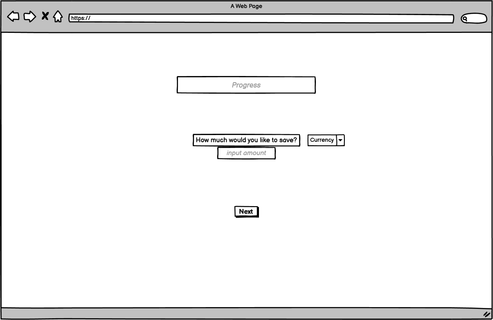
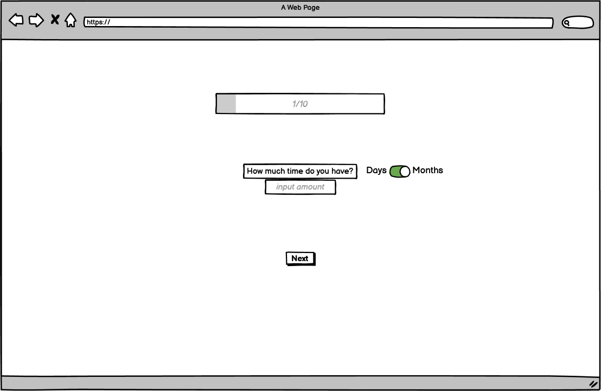
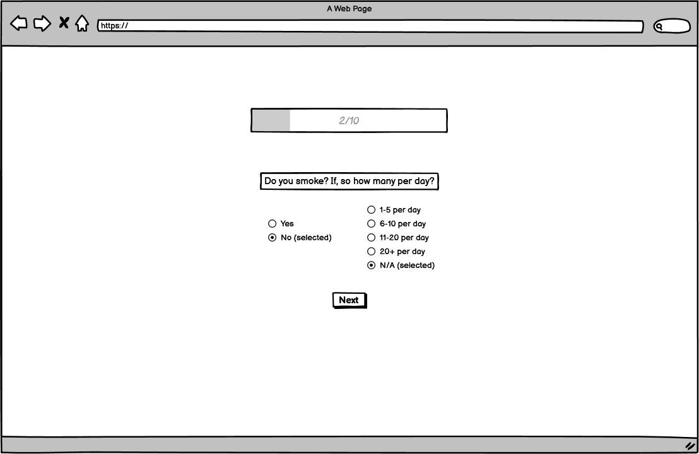
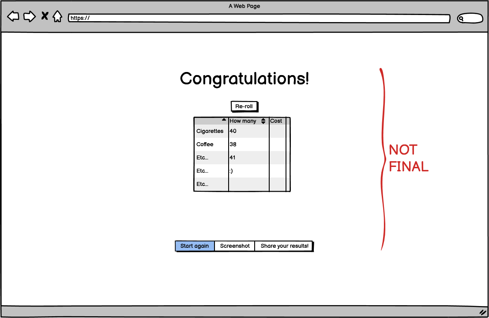

# Project Tittle - *Revolutionising Finance for 2023*
---
**Table of Contents:**
---
---

* [Project Description](#project-description)
    * [Concept](#concept)
    * [Intention](#intention)
    * [Audience](#audience)
* [Wireframes](#wireframes)
    * [Initial Wireframes](#initial-wireframes)
    * [Final Wireframes](#final-wireframes)
* [Features](#features)
    * [Header](#header)
    * [Footer](#footer)
    * [Unified colour scheme](#unified-colour-scheme)
    * [Navigation](#navigation)
    * [Progress Bar](#progress-bar)
    * [Personality Questions](#personality-questions)
    * [Currency Converter](#currency-converter) 
* [Accessbility](#accessibility)
* [Design Choices](#design-choices)
    * [Font](#font)
    * [Images](#images)
    * [Widgets](#widgets)
    * [Colour Schemes](#colour-scheme)
* [Code Explanations](#code-explanations)
    * [HTML](#html)
    * [JavaScript](#javascript)
    * [API](#api)
    * [Materialize/Bootstrap?](#materialize/bootstrap)
* [Bugs](#bugs)
* [Deployment](#deployment)
    * [User Interaction](#user-interaction)
* [Testing](#testing)
* [Credits](#credits)

---

## Project Description 
---

Collectively as a group we pitched different ideas to each other, in response to the theme revolutionsing finance for 2023. A key challenge was being able to identify the ideas that would best marry up, with our time schedule. After realising some ideas would be overly ambitious, we concluded that there could be ingenuity in simplicity. 

Hitting upon our idea, we delved further into how we could ensure that we solved a **problem**, and responding to this, with the implemntation of our tech skills. We discussed how our potential target audience could be handling budgeting, at a time where our living standards are suffering, because of the cost of living and energy crisis. Everyone has had to be a bit more thrifty and cut back where they can. What we wish to achieve is a budgeting app, that uses visual representations, to enable the indiviudal to make better choices on how they spend and save their money, over a peroid of time. 

Initially the user will sign up to the application and take a personality test, this will allow a randomiser to generate user specific visuals from their answers. For instance over a peroid of a week how often do you buy a cup of coffee, in turn this will generate the weekly cost in either sterling, dollars or euros. In order to have reall time exchange values we have used an api .... 

### Concept 

---

### Intention

---

### Audience

---

Our target audience would be those predominantly feeling the pinch, as a result of the cost of living crisis. Communicating in a fun and engaging way is key to how we will respond to our potential user basis's concerns and needs. Taking a less serious approach would act as ice breaker, making the world of finace feel a bit more digestable to the every day joe.

## Wireframes

---

### Initial Wireframes

---

### Final Wireframes

---

## Features

### Header

### Footer

### Unified Colour Scheme

### Navigation

### Progress Bar

### Peronality Questions

### Currency Converter

## Accessibility

## Design Choices

### Font

### Images

### Widgets 

### Colour Schemes

## Code Explanations

### HTML

### JavaScript

### API

### Materialize/Bootstrap?

## Bugs

## Deployment

### User Interaction

## Testing

## Credits

