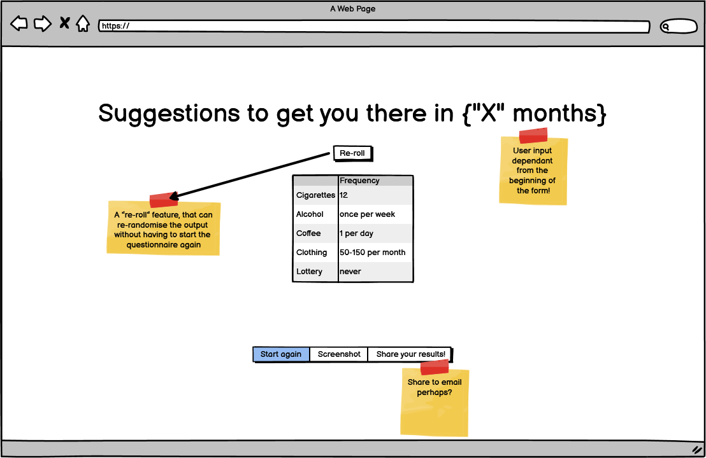

# Project Tittle
---
**Table of Contents:**

* Project Description
    * Concept
    * Intention
    * Audience
* Wireframes
    * Initial Wireframes

    With regards to the theme of the programme "Revolutionizing Finance", we thought about different themes to adopt and then finally decided to look at how understanding finance individually can lead to putting more money aside over a period of time. 
    Discussion around the project started on 20th January 2023with some basic sketche drawn using Balsamiq later updated as more suggestions were discussed.

    Firstpage:
    

    Question Pages:

    To be able to put aside some amount over a period of time, the user is asked about the different luxuries he spends on and then a randomisation is done to suggest to the user how he can cut down on them for his intended savings.

    
    
    
    
    
    

    Final Page:
    
    
    * Final Wireframes
* Features
    * Header
    * footer
    * Unified colour scheme
    * Navigation
    * Progress Bar
    * Personality Questions
    * Currency Converter 
* Accessbility
* Design Choices
    * Font
    * Images
    * Widgets
    * Colour Schemes
* Code Explanations 
    * HTML
    * JavaScript
    * API
    * Materialize/Bootstrap?
* Bugs
* Deployment
    * User Interaction
* Testing
* Credits

---
## Wireframes ##
 * Initial Wireframe
 
 With regards to the theme of the programme "Revolutionizing Finance", we thought about different themes to adopt and then finally decided to look at how understanding finance individually can lead to putting more money aside over a period of time. 
    Discussion around the project started on 20th January 2023with some basic sketche drawn using Balsamiq later updated as more suggestions were discussed.

## Credits ##
One of the team member provided the idea of looking at finance management through the individual rather than looking at the whole society at large. It sounded to us a beautiful idea and the team decided to put more together on it

**Acknowledgements**

**0rganisers** of January edition of hackathon, a massive thank you to you for giving us this opportunity.

**Team members** for giving out your time for this project, a big thank you for been available even in these busy times.

**MDN website** was used to access some of the things needed that were unknown, it was also used to validate some of the work done.

