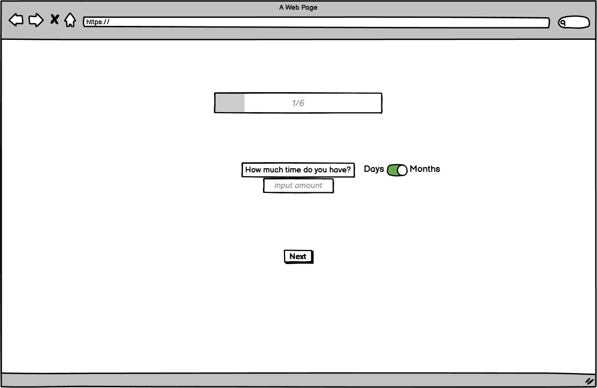
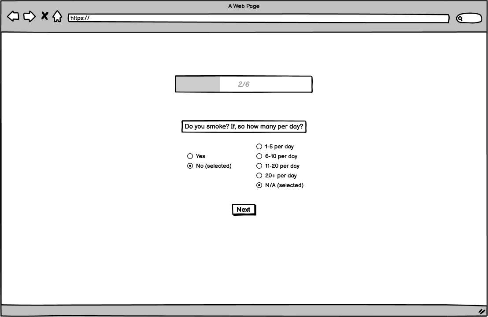
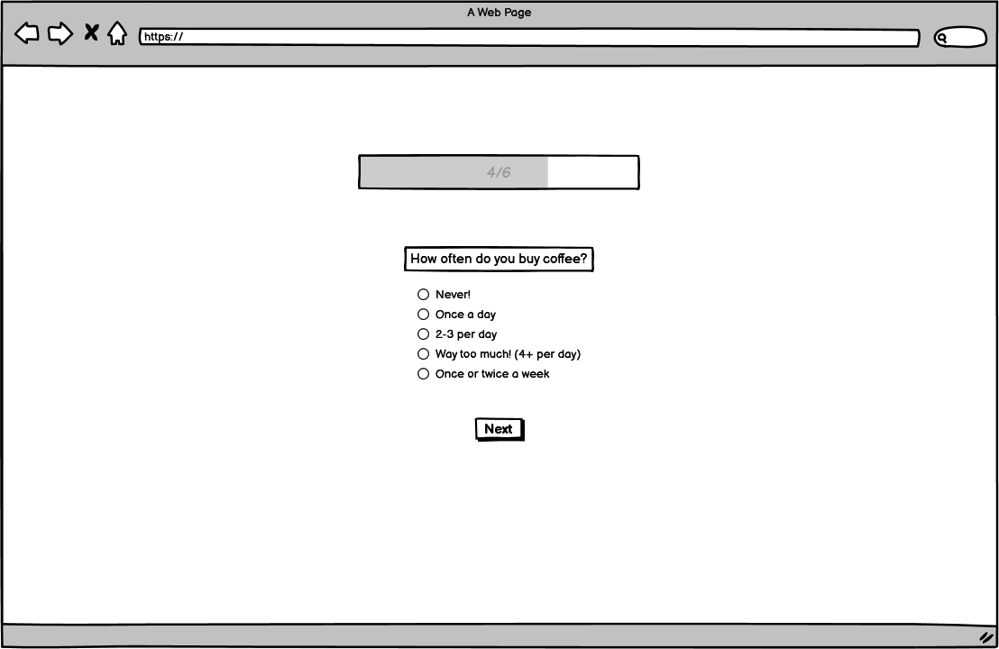
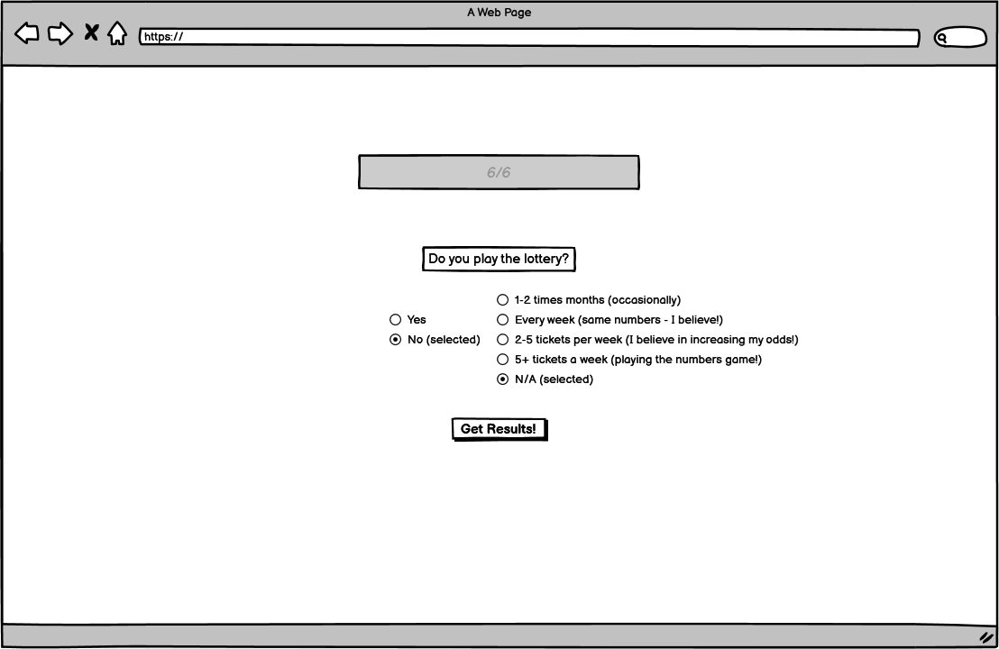

# Penny Smart - *Revolutionising Finance for 2023*

**Table of Contents:**
---
---

* [Project Description](#project-description)
    * [Concept](#concept)
    * [Intention](#intention)
    * [Audience](#audience)
* [Wireframes](#wireframes)
    * [Initial Wireframes](#initial-wireframes)
* [Features](#features)
    * [Header](#header)
    * [Footer](#footer)
    * [Unified colour scheme](#unified-colour-scheme)
    * [Progress Bar](#progress-bar)
    * [Radio Buttons](#radio-buttons)
    * [Personality Questions](#personality-questions)
    * [Currency Converter](#currency-converter) 
* [Accessbility](#accessibility)
* [Design Choices](#design-choices)
    * [Font](#font)
    * [Unified Colour Schemes](#unified-colour-scheme)
* [Technology, Frameworks and Programs](#technology-frameworks-and-programs)
    * [Languages](#languages)
    * [Frameworks and Programs](#frameworks-and-programs)
* [Bugs](#bugs)
* [Deployment](#deployment)
* [Testing](#testing)
* [Credits](#credits)
    * [Resources](#resources-used)
    * [Acknowledgments](#acknowledgements)

---
## Project Description 
---

As a group, we collectively pitched different ideas to each other, in response to the theme of "Revolutionsing Finance for 2023". A key challenge was being able to identify the ideas that would best marry up with our time schedule. After realising some ideas would be overly ambitious, we concluded that there could be ingenuity in simplicity. 

Hitting upon our idea, we delved further into how we could ensure that we solved a **problem** for the end user. We discussed who our potential target audience could be and how they would be handling budgeting; especially at a time where our living standards are increasingly suffering. Everyone has had to be a bit more thrifty and cut back where they can. So, what we wished to achieve is a budgeting app; that uses visual representations to enable the indiviudal to make better choices on how they spend and save their money. By adding a random element to it, we wanted it to remain fun and to not take itself too seriously for the end user.

Initially the plan was to have a user sign up using a page linked to a nav bar, however we ran into complications trying to achieve this using materialize. So we decided that it could be marketed as an application tool instead.

Having done some mild research on "useless expenses" we wanted the user to take a quick personality test to identify some of these key areas. This would allow our built in functions, in JavaScript, to randomly generate user specific answers linked to their lifestyle spending: Highlighting how the individual can save money over a chosen period of time. For instance: How often does the user buy a cup of coffee and or how often the user smokes, in turn this will generate the weekly cost in either Sterling, Dollars or Euros. The results page will then present the user with randomised (lesser) amounts of each, in order to save the user the amount of money in the chosen amount of time.

The application will interact with an API in order to have real-time exchange values between Sterling, Dollars and Euros.

### Concept 
---

Coding being logic based, creativity allowed us to explore and critique our methods as we progressed through the project. We utilised "Huddle", a feature on slack, to keep regular contact with the team. This allowed us to pursue our vision and concept in a uniformed way. We needed to keep asking who, what, why and how questions in order to achieve what we set out to do. 

Main conceptual points are as follows:

* Interact with our audience in a fun and engaging way, **times are hard** dont be too serious e.g. this could be represented by using a playful colour pallete and widgets.
* Ask questions to guage the individuals personality, we have decided to start with **5-7 questions** but if we had more development time we would certainly add more.
* Use a **progress bar** to give a visual representation to the user on the number of questions that needed to be answered.
* By specifiying how much money the user wants to save in a set amount of time the app will generate a response using visual representations. 
* Alerting the user to the fact that by **reducing** their **consumption** of, for example, coffee they will be able to save their desired amount of money over *"x"* peroid of time.

### Intention
---

Penny Smart aims to be marketed towards modern banking applications like **Monzo**, **Revolut** and **Starling**. These banks could incorporate our application into their existing applications to help their users with budgeting needs in a fun way.

### Audience
---

Our target audience would be those who are predominantly feeling the pinch, as a result of the cost of living crisis. Taking a less serious approach to act as an ice breaker, we are primarily focused on targetting 18-40 year olds.

## Wireframes
---

### Initial Wireframes
---

The landing page will ask the user how much money they would like to save and a choice between Sterling, Dollars and Euros. It includes a progress bar and a navigation bar to enable the user to identify how far they are to the end. The user is then able to use the next button to move onto the next question. The following wireframes will include an array of input boxes, radio buttons, switches and submit/reset buttons.

##### Wireframe 1: The landing page

 

##### Wireframe 2: How much time?

##### Wireframe 3: How much does the user smoke?

##### Wireframe 4: How much alcohol does the user drink?

##### Wireframe 5: How often does the user buy coffee?

##### Wireframe 6: How much does the user spend on clothing?

##### Wireframe 7: How much money does the user spend on the lottery?

##### Wireframe 8: The final frame showing the user randomised results/suggestions for them to save the desired amount of money in chosen amount of time.

 

---

## Features
---
* #### Header
    * The header will feature the applications name and logo.

* #### Footer
    * The footer will feature information about the team.

* #### Unified Colour Scheme
 [Original colour pallete test using coolors.co](https://coolors.co/palette/05668d-427aa1-ebf2fa-679436-a5be00)
    
    Discussing the colour palette allowed us to think about the our audience and who it would appeal to, this was a first demo and we decided that muted coolours would be better suited as the greens came across quite aggressive and didn't communicate our concept as well as it could have done.
 [Final colour pallete test using coolors.co](https://coolors.co/palette/49c6e5-54defd-fffbfa-00bd9d-8bd7d2)
   
    We believed that this colour palette situated itself better with our concept and theme. The meanings behind the colours blue and green refer to harmony and prosperity. The blue tint evokes trustworthiness and wisdom.

* #### Progress Bar
    * This shows the user the progress they have made with engaging the available questions. The progress bar is assigned as part of a way to improve the user experience.

* #### Radio Buttons
    * We chose to use radio buttons because of their simplicity. Thia also means the user couldn't leave it blank, potentially harming our JavaScript calculations.

* #### Peronality Questions
    * How much would you like to save?
    * How much time do you have?
    * Do you smoke? if, how many packs per week?
    * do you drink? how many drinks per week?
    * Do you buy coffee? How many per day?
    * Do you go clothes shopping? How much do you spend per month?
    * Do you play the lottery? How many tickets per week?

* #### Currency Converter
    *  Using an API we will display real time conversions between Sterling, Dollars and Euros.

## Accessibility
---

## Design Choices
---

* Our design choices were dictated by our ability to implement Materialize's framework to the front end design. While presenting challenges, it allowed us to achieve a clean design that would communicate our theme and concept to the end user.
* Originally, the first two questions about currency and the frequency of time were going to have toggles, but the front end team decided to use drop down boxes to make the experience clearer and easier to manage on JavaScript.

### Font
---

* Sans-serif
    * Evokes a clean minimal style, keeping it friendly and modern.
* Exo-Bold and Helvetica
    * The logo utilised two different fonts to keep it stylised and eye catching.

## Technology, Frameworks and Programs
---

### Languages

* HTML

* JavaScript

* CSS

* API

### Frameworks and Programs

* Materialize
    * Being something new, this initially came with it's challenges. As the team was more comfortable with CSS. At first it was believed that the colour selection in Materialize was quite restrictive, however, during a team talk we worked out that this can be overridden. We learnt that it acts as a template that uses industry standard assets and it allowed us to save a large amount of time to achieve the visual features that we wanted. 
* Github and IDEs included Gitpod and VSCode
    * Storing repositories and manipluating code cross party
* Slack
    * Video calls and messaging, allowing the team to keep communication free flowing
* Balsamiq
    * creating wireframes to plan our project

## Bugs
---

* Radio buttons
    * During a huddle team talk we realised that our radio buttons were not appearing, once rendered. We discovered that the label element was missing from the syntax and because we were using Materialize it required an input as a child element. This was fixed. However, we then ran into further complications and had to put the input before the labels to fix the bug of the radio button dissapearing.
* Materialize
    * Being guided by our experienced group members, we all learnt that Materialize works on a grid basis. This caused problems in trying to centre our text on the navigation bar, where originally we were going to have a sign up link. However, the bugs would have needed specific media queries to iron it out and that would have been better achieved at the start of the project, we took the creative choice to drop the sign up option and present our application as more of a tool.

## Deployment
---
* The project will be deployed on github, we believed this to be the least complex method allowing us to showcase our project.

## Testing
---

* Lighthouse
    * Results: 

## Credits
---

* **TEAM - BROKE BUSTERS!**

* Scrum Master

    * Destan Tezel

* Front end designers 
    
    * Rashidat Adekoya
    * Andrés Felipe García Cano

* Back end designers

    * Adam Boley
    * Cara McAvinchey

* Readme and logo design curation 

    * Rhys Few
    * Oluwaseun Omisakin

### Resources

* [https://coolors.co/](https://coolors.co/)
* [https://balsamiq.com](https://balsamiq.com/wireframes/?gclid=Cj0KCQiAt66eBhCnARIsAKf3ZNG3MDPZckauwhwQnD_zYLS6G7lBdpDlTvyny6heY507HgosJldUoOEaAvMVEALw_wcB)
* [https://materializecss.com/](https://materializecss.com/)
* [https://github.com/](https://github.com/)
* [https://www.markdownguide.org/basic-syntax/](https://www.markdownguide.org/basic-syntax/)
* [https://github.com/AdamBoley/The-Space-Marine-Legions](https://github.com/AdamBoley/The-Space-Marine-Legions)
* [https://andresfgc.github.io/ROE-Checker/](https://andresfgc.github.io/ROE-Checker/)
* [https://www.rightmove.co.uk/mortgages/mortgage-calculator](https://www.rightmove.co.uk/mortgages/mortgage-calculator)
* [https://www.revolut.com/](https://www.revolut.com/)
* [https://monzo.com/](https://monzo.com/)

### Acknowledgments

* Organisers: A very big thank you for putting together the Jan-Hackathon-2023. 

* Team Members: for making **huge** amounts of time out of their day to create and run this project.

* W3Schools and MDN sites provided guidiance on how to put together the input tag.

* Materialize for providing access to some of the materials used in the project.

* The lighthouse testing function provided suggestions which was used to improve the performance of the project.
